<div align="center">

<picture>
  <source media="(prefers-color-scheme: dark)" srcset="./banner.svg">
  <source media="(prefers-color-scheme: light)" srcset="./banner-light.svg">
  
</picture>

<br>


# 👋 Hi, I'm Battu Naga Roopa Sri

### 💻 Full Stack Developer • Java Developer • AI Enthusiast

> **Building elegant software that solves real-world problems ✨**

<p>

<a href="https://github.com/BattuNagaRoopasri">

</a>

<a href="mailto:roopasri.0812@gmail.com">

</a>

<a href="https://www.linkedin.com/in/naga-roopasri-battu-b88b95282/">

</a>

<a href="https://roopasri-portfolio13.vercel.app">

</a>

</p>


</div>

---

# 🌸 About Me

```yaml
Name: Battu Naga Roopa Sri

Education:
  🎓 B.Tech CSE Graduate

Location:
  📍 Andhra Pradesh, India

Current Focus:
  🚀 Full Stack Development
  🤖 AI Applications
  ☁️ Cloud Technologies

Learning:
  • System Design
  • DevOps
  • Advanced React

Interests:
  ☕ Coffee
  🎵 Music
  💻 Coding
  🌸 Anime
```

---

# 💻 Tech Stack

<div align="center">


</div>

---

# 🚀 What I Build

✨ Responsive Web Applications

🤖 AI Powered Applications

📊 Data Visualization Projects

⚡ REST APIs

🧠 Machine Learning Projects

📱 Modern MERN Applications

---

# 📊 GitHub Analytics

<div align="center">




</div>

<br>

<div align="center">


</div>

<br>

<div align="center">


</div>

---

# 🚀 Featured Projects

| Project | Description |
|---------|-------------|
| 🥗 NutriWise | AI Nutrition Recommendation System |
| 📚 Online Examination System | Secure Examination Portal |
| 🤟 Sign Language Recognition | CNN based Recognition System |
| 🧬 Hepatitis C Prediction | Machine Learning Prediction |
| 🧮 Crazy Math Game | Interactive Learning Game |

---

# 📈 Contribution Graph

<div align="center">


</div>

---

# 🐍 Contribution Snake

<div align="center">


</div>

---

# ⚡ Currently Working On

- 🌐 Full Stack Web Applications
- 🤖 AI Integration Projects
- ☁️ Cloud Deployment
- 📚 Learning System Design

---

# 🌎 Connect With Me

<div align="center">

<a href="mailto:roopasri.0812@gmail.com">

</a>

<a href="https://www.linkedin.com/in/naga-roopasri-battu-b88b95282/">

</a>

<a href="https://roopasri-portfolio13.vercel.app">

</a>

</div>

---

<div align="center">

## 💖 Favorite Quote

```java
while(alive){

    Learn();

    Build();

    Improve();

    Repeat();

}
```

### ✨ "Turning ideas into reality through code."

⭐ Thanks for visiting my profile!

</div>
